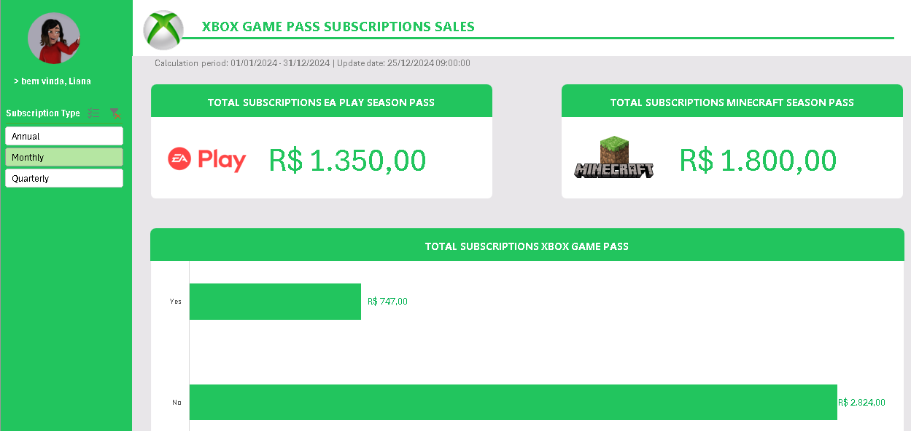
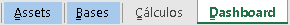

# README - Dashboard Incrível com Felipão: Guia Completo e Didático

Este repositório contém o projeto do Dashboard de Vendas desenvolvido em Excel. Inspirado nas aulas do Felipão, este projeto transforma dados brutos em informações visuais claras e úteis, permitindo uma análise eficaz do desempenho de vendas e a tomada de decisões baseadas em dados.

Este documento reúne, de forma detalhada, os principais insights e metodologias apresentados pelo Felipão, abordando desde a organização dos elementos e dos dados até a personalização visual e os ajustes finais de um dashboard pronto para apresentação.

---

## 1. Introdução e Contexto

Felipão compartilha sua experiência prática na criação de dashboards – uma jornada repleta de desafios, aprendizados e métodos que transformam dados brutos em informações estratégicas. Originalmente desenvolvido em Excel, o dashboard era essencial para decisões na empresa, mas logo se mostrou complexo para manutenção. Essa dificuldade motivou a criação de uma metodologia organizada, onde todos os detalhes fazem a diferença.

O ponto-chave da abordagem é que, independentemente da ferramenta (Excel, Power BI, etc.), o sucesso depende da organização, clareza e usabilidade do dashboard. Conforme Felipão diz, “é perigoso ir sozinho”. Por isso, contar com uma metodologia robusta e replicável é fundamental para se destacar em entrevistas, apresentações e na prática diária.

---

## 2. O Método ABCDE: Organização e Estruturação

Uma das grandes lições é a metodologia **ABCDE**, que divide o projeto em cinco partes essenciais:

- **A – Assets:**  
  Centralize todos os recursos visuais (imagens, GIFs, vídeos, áudios, paletas de cores, ícones, etc.) em uma aba ou pasta específica. Isso facilita a manutenção e garante consistência visual.

- **B – Bases:**  
  Armazene os dados brutos que alimentam o dashboard (ex.: registros de vendas, datas, categorias e valores). Dominar esses dados é essencial, como conhecer os ingredientes de uma receita.

- **C – Cálculos:**  
  Utilize fórmulas, scripts ou regras (funções do Excel, fórmulas DAX, etc.) para transformar os dados brutos em informações úteis e insights estratégicos.

- **D – Dashboard:**  
  Construa o painel visual que apresenta as informações de forma clara e intuitiva. A disposição de gráficos, tabelas dinâmicas e slicers deve facilitar a interpretação sem sobrecarregar o usuário.

- **E – Extras:**  
  Organize materiais de apoio (documentações, PDFs, estudos) que complementem e enriqueçam o entendimento do projeto.

---

## 3. Desenvolvimento do Dashboard e Uso de Tabela Dinâmica

### Organização Inicial

- Estruture o arquivo Excel criando abas específicas para cada função:  
  - **Assets:** Contém os recursos visuais.  
  - **Bases:** Armazena os dados brutos.  
  - **Cálculos:** Contém tabelas dinâmicas e fórmulas.  
  - **Dashboard:** Exibe a interface final e interativa.

### Tabela Dinâmica

- Selecione a base de dados (por exemplo, utilizando Ctrl+Shift).
- Insira uma tabela dinâmica na aba de cálculos para responder a perguntas estratégicas, como filtrar vendas por período ou condições específicas.
- Reorganize os campos e aplique filtros para transformar dados brutos em insights práticos, como o total das vendas do EA Play ou as assinaturas do Minecraft Season Pass.

---

## 4. Customização Visual e Integração dos Elementos

### Gráficos e Visualizações

- **Gráficos Dinâmicos:**  
  A partir dos dados processados na tabela dinâmica, insira um gráfico de barras. Remova elementos desnecessários (linhas de grade, controles extras) para um visual limpo e focado.

- **Códigos de Cor e Identidade Visual:**  
  Utilize códigos hexadecimais (extraídos dos assets) para manter a consistência visual com a identidade do projeto (por exemplo, a identidade do Xbox).

### Layout e Organização

- **Menus e Elementos Fixos:**  
  Crie um menu lateral com logotipo, configure as imagens para que não se movam ou redimensionem com as células e use retângulos com cantos arredondados para delimitar zonas de dados.
  
- **Segmentadores de Dados (Slicers):**  
  Personalize os filtros ajustando bordas, cabeçalhos, fontes e preenchimentos para que se integrem ao design.
  
- **Big Numbers:**  
  Destaque os principais KPIs utilizando cards dinâmicos (retângulos com cantos arredondados vinculados às células da tabela dinâmica).

---

## 5. Ajustes Finais e Refinamento da Interface

### Toques Finais

- **Personalização da Interface:**  
  Insira ícones e mensagens personalizadas (ex.: “Bem-vinda Liana”) e ajuste recuos, alinhamentos e espaçamentos para criar uma simetria visual.

- **Ocultação de Elementos Supérfluos:**  
  Remova abas extras, títulos e a barra de fórmulas para que o dashboard apresente apenas o conteúdo relevante.
  
- **Refinamento Visual:**  
  Configure os objetos para que não se movam com as células, aplique bordas consistentes (ex.: com um tom de verde) e agrupe gráficos, cards e slicers para ajustes coletivos. Utilize o modo tela inteira para uma visualização limpa e sem distrações.

Cada detalhe – da organização dos dados aos toques finais de design – contribui para a eficácia do dashboard na comunicação dos insights e na facilitação da tomada de decisão.

---

## 6. Conclusão e Reflexões Finais

A criação de um dashboard vai muito além de exibir números; trata-se de transformar dados brutos em informações estratégicas. Resumos dos aprendizados:

- **Organização é Fundamental:**  
  A metodologia ABCDE garante que cada etapa do projeto seja clara e escalável.

- **O Poder da Customização:**  
  Gráficos bem escolhidos, o uso consistente de cores e um layout intuitivo transformam o dashboard num instrumento poderoso de análise.

- **Detalhes que Fazem a Diferença:**  
  Toques finais – como a personalização de mensagens, ícones e o agrupamento de elementos – elevam o nível do painel, tornando-o profissional e atraente.

Que este guia inspire você a continuar aprimorando suas habilidades e a criar dashboards que realmente façam a diferença na tomada de decisões estratégicas!

---

## 7. Apoio Visual

Para tornar este README ainda mais dinâmico, adicionamos imagens ilustrativas:

### Exemplo do Dashboard Final



### Organização das Abas



*As imagens acima demonstram a estrutura do arquivo e a aparência final do dashboard.*

---

## 8. Instruções para Reprodução

1. **Clone o Repositório:**
   ```bash
   git clone https://github.com/seu-usuario/nome-do-repositorio.git
   ```
2. **Abra o Arquivo Excel:**
- Abra o arquivo dashboard_vendas.xlsx no Excel.

3. **Explore as Abas:**
- **Assets:** Recursos visuais (imagens, ícones e paletas de cores).
- **Bases:** Dados brutos de vendas.
- **Cálculos:** Tabelas dinâmicas e fórmulas.
- **Dashboard:** Interface final com visualização dos KPIs.

4. **Interaja com o Dashboard:**
- Utilize os slicers para filtrar os dados e observe os “big numbers” e gráficos atualizarem automaticamente conforme os filtros são aplicados.

---

## 9. Considerações Finais
Este projeto demonstra como organizar, analisar e apresentar dados de vendas de forma estratégica, combinando metodologia, usabilidade e design. A abordagem inspirada nos ensinamentos do Felipão serve como referência tanto para profissionais iniciantes quanto para os mais experientes, ajudando a transformar desafios em soluções visuais e impactantes.

Agradeço por explorar este repositório e espero que os conceitos aqui apresentados inspirem você a criar dashboards que elevem a comunicação dos insights e aprimorem a tomada de decisão.
